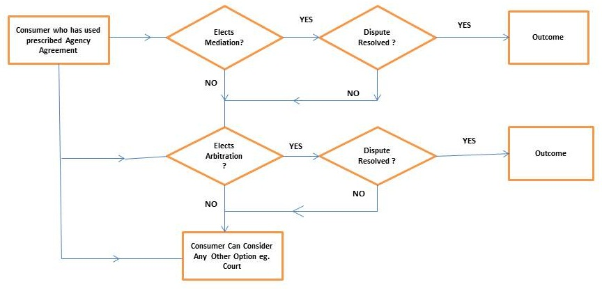

# Dispute Resolution

## Key Points
 - Election of Judges
 - Evidence
 - Incentivization
 - Insurance
 - Broadcasting of disputes (How do we notify people their domain is involved in a dispute)

## Goals

The goals of the ENS dispute resolution system is to provide a way for the ethereum community to be able to blacklist 
nodes they deem as not safe or scam addresses. Additionally, there should be a method to get nodes / domains to their rightful owners.
Name squatting should be disincentivized.
The largest issue however is how we can incentivize a broad community of 
members to act justly in this system. This should be achieved without trusted judges and members that can override the system.

The arbitration system should be usable by the entire ENS community and should have a large success rate. 
This means that bad actors should be identifiable. Incentivization needs to be solved for without using a tokenized 
model, one proposed solution to this could be an insurance type system demanding all node owners to get a dispute insurance.

The arbitration system should be similar to that of [ICANN](https://www.icann.org/resources/pages/help/dndr/udrp-en), there is no point in reinventing the wheel.

## Problems

### Inactive Parties

### Insurance

## Proposal

The core dispute resolution system is split into 2 separate phases:
1. [Mediation](mediation.md)
2. [Arbitration](arbitration.md)

The former of which is cheap for both parties and easy to organize, where as the latter becomes more expensive and will 
most likely create serious overhead for the entire ecosystem.

Ideally most disputes would be handled through a mediation phase.

### Network Effects

Additionally it is important that signals from the ENS user base are taken into consideration, for example a domain that 
has been blacklisted on various wallets such as [MyCrypto](https://mycrypto.com/) or [MyEtherWallet](https://www.myetherwallet.com/)
can most likely be considered malicious, the question here however is how this is broadcasted to the rest of the network.
Do these wallets implement public [blacklists](https://github.com/ensdomains/blacklist) or should their actions allow for the
opening of a dispute?

### Trademarks & Copyright

@TODO: Discuss whether these should be considered or not.

## Process

@TODO make proper diagram.

@TODO highlight proposed process.

## Components

- [Blacklist](https://github.com/ensdomains/blacklist)